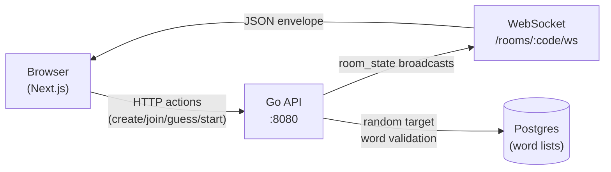

# Wordle Rooms

Multiplayer Wordle with real-time rooms — create a room, share a code, everyone plays the same word simultaneously, live scoreboard updates as guesses come in.

## Demo

<!-- TODO: add docs/screenshot.png before publishing -->

Live demo: _deploy URL here_

## What it does

Players create a room and share a 4-letter code with friends. Everyone who joins is assigned an opaque token stored in `localStorage` — no accounts required. The host picks when to start each round; all players receive the same target word and have six guesses to solve it. While the round is live, each player can only see their own guesses (spoilers are hidden server-side). When the last player finishes, the round ends automatically: all grids are revealed, the target is shown, and a ranked leaderboard appears. The host can start another round immediately. A single-player mode is also available at `/play`.

## Architecture



HTTP carries all mutations (create room, join, submit guess, start round). WebSocket carries only outbound notifications — the server pushes a fresh `room_state` snapshot to every connected client after each mutation. Room state itself lives in server memory; Postgres stores only the word lists.

When a player disconnects, a 15-second grace period allows them to reconnect before the server finalises the drop. If the departing player is the host, `migrateHost` automatically transfers host status to the next-oldest active player; the next WS broadcast notifies all clients of the change.

## Tech stack

- **Go 1.22** — backend; fast compilation, strong stdlib concurrency primitives, single binary deploy
- **chi** — lightweight HTTP router; minimal surface area compared to full frameworks
- **gorilla/websocket** — WebSocket server; handles ping/pong and connection lifecycle
- **Postgres** — stores the answer list and valid-guess dictionary; seeded on startup
- **In-memory room store** — rooms live in a `sync.RWMutex`-guarded map; no persistence needed for short-lived games
- **Next.js 16 + TypeScript** — frontend; App Router, `"use client"` components, no extra state library
- **Tailwind CSS** — utility classes used sparingly; most layout is inline `React.CSSProperties`

## Running locally

Prerequisites: Go 1.22+, Node 22+, pnpm, Docker.

```bash
make up        # start Postgres in Docker
make backend   # start Go API on :8080 (second terminal)
make frontend  # start Next.js dev server on :3000 (third terminal)
```

Visit [http://localhost:3000](http://localhost:3000).

`make help` lists all available targets.

## Project structure

```
wordle-rooms/
├── backend/
│   ├── cmd/server/        # main entry point
│   └── internal/
│       ├── api/           # HTTP handlers + router + WS upgrade
│       ├── db/            # Postgres pool + migrations
│       ├── game/          # single-player game logic + store
│       ├── realtime/      # WebSocket hub + client + registry
│       ├── room/          # room model, store, view builder, ranking
│       └── words/         # word repository + seeder
├── frontend/
│   └── src/
│       ├── app/           # Next.js App Router pages (/, /play, /room/[code])
│       ├── components/    # Game, Scoreboard, FinishModal
│       └── lib/           # API client, token helpers, useRoomSocket hook
├── docker-compose.yml     # Postgres only — backend/frontend run on host
├── Makefile
├── .env.example
├── DECISIONS.md           # design rationale and trade-offs
└── LICENSE
```

## Design notes

See [DECISIONS.md](DECISIONS.md) for design rationale and trade-offs — why Go over Node, why HTTP+WS split, why in-memory state, and more.

## Known limitations

These are deliberate trade-offs, not overlooked bugs:

- **Rooms live in server memory** — a restart wipes all active games. Durability would require Redis or Postgres-backed room state; the added complexity isn't justified for short-lived games (see [DECISIONS.md](DECISIONS.md)).
- **Single-server only** — WebSocket connections are pinned to one process. Horizontal scaling would require a Redis pub/sub fan-out layer.
- **No mid-round join** — players must join before the host starts. A late-joiner path (empty board, same target) is possible but deferred.

## License

MIT — see [LICENSE](LICENSE).
